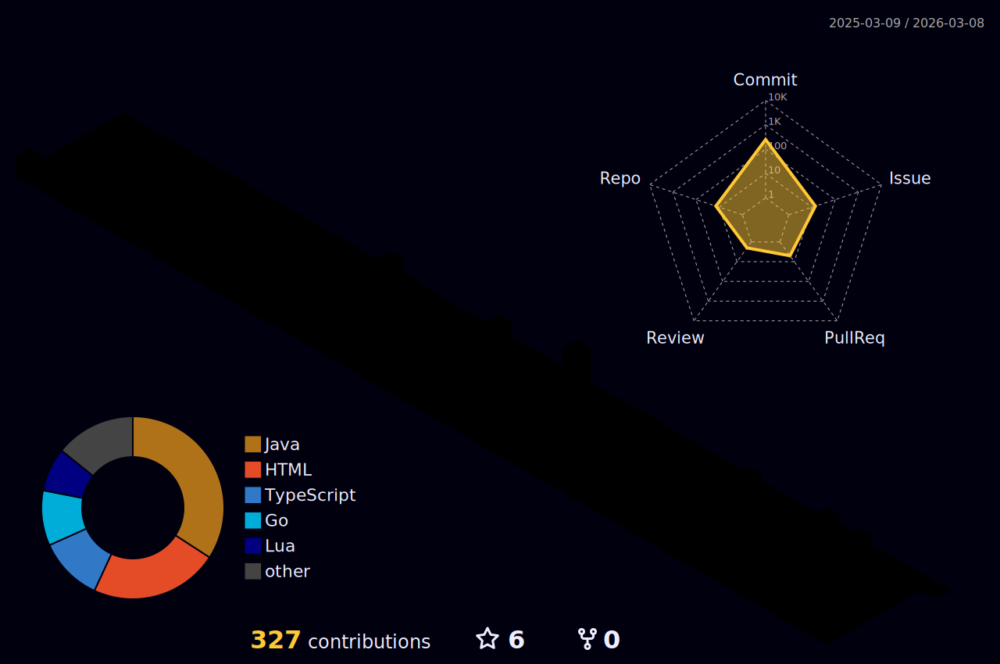

<h1 align="center">Hi there, I'm Simon 👋</h1>

  

  
  

---

## 🧠 About Me

- 🎓 CS graduate with a passion for **concurrent systems** and **type-safe programming**

- 💬 Fluent in Java, Erlang, Haskell, Dafny, Python, and sarcasm 😄

---

## 🌱 Currently Learning

- 🔍 LLM
- 🧩 Algoritms
- 💬 Reading: *Software Foundations*, *Designing Data-Intensive Applications*

## 🧰 Languages & Tools

---

## 📊 GitHub Stats

---

## 🔥 GitHub Streak

---

## 🏆 GitHub Trophies

  

---

## 📫 Connect With Me

- 📍 Based in **Gothenburg, Sweden**
- 🌐 [LinkedIn Profile](https://www.linkedin.com/in/simon-johansson-software-genius/)
- 📧 simon@email.com (replace with your real one)
- 💼 Open to full-time roles, internships, research projects, and weird programming experiments

---

_Thanks for dropping by! If you scrolled this far, you should probably hire me._ 😎
